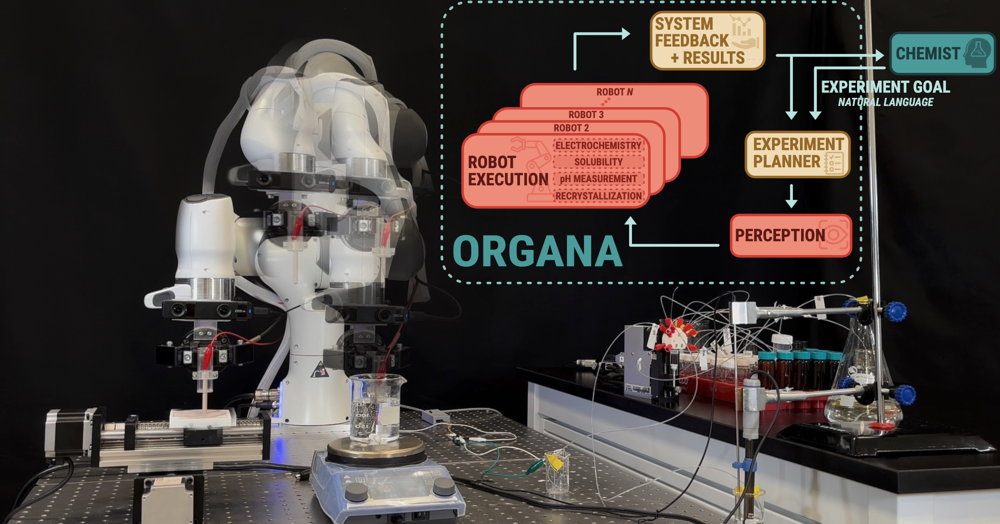

# ORGANA: A Robotic Assistant for Automated Chemistry Experimentation and Characterization

[**Paper**](https://ac-rad.github.io/organa/) | [**Project**](https://ac-rad.github.io/organa/) | [**Video**](https://www.youtube.com/watch?v=N6qMMwJ8hKQ)

This is the repository that contains the source code for the ORGANA website. 

## Introduction
ORGANA is a Robotic assistant that provides a seamless interaction between SDLs and chemists for diverse chemistry experiments. It perceives the objects and the progress of the chemistry task to make an informed decision for the next steps of the chemistry experiment. Informed decisions, guided by user intention and perception, are a key strength. ORGANA optimizes SDL efficiency through parallel experiment execution, providing timely feedback via reports and analysis, thus keeping users well-informed and involved in high-level decision-making.




## Citation
```
@misc{darvish2024organa,
      title={ORGANA: A Robotic Assistant for Automated Chemistry Experimentation and Characterization}, 
      author={Kourosh Darvish and Marta Skreta and Yuchi Zhao and Naruki Yoshikawa and Sagnik Som and Miroslav Bogdanovic and Yang Cao and Han Hao and Haoping Xu and Alán Aspuru-Guzik and Animesh Garg and Florian Shkurti},
      year={2024},
      eprint={2401.06949},
      archivePrefix={arXiv},
      primaryClass={cs.RO}
}
```
